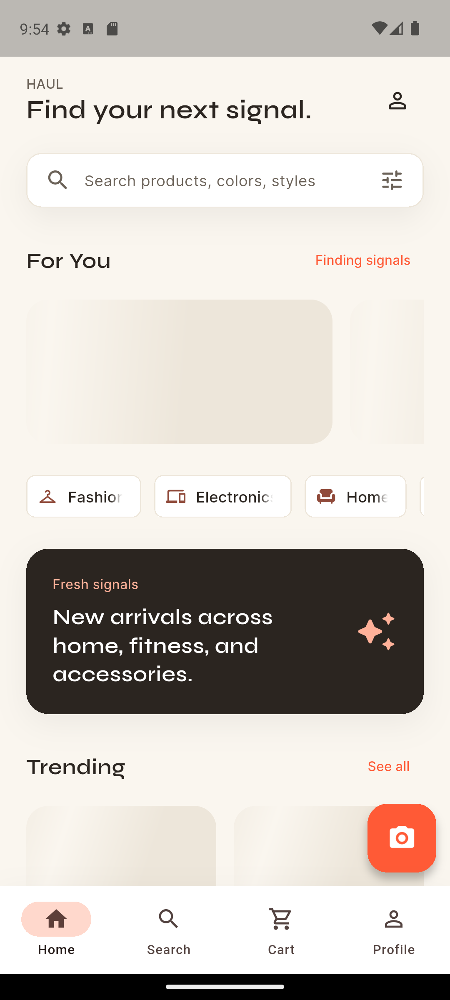
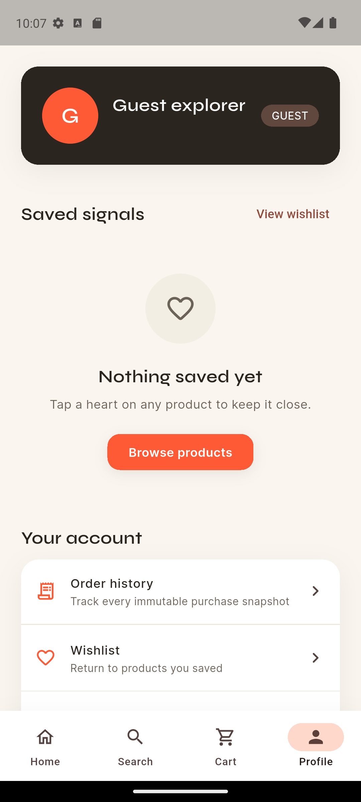

# Haul

Haul is an Android-first Flutter commerce portfolio app built around visual
search, personalized recommendations, resilient offline state, and a
server-authoritative Stripe test checkout.



## Product Tour

- Guest and Firebase account flows
- Search, filters, product detail, cart, and wishlist
- Gallery/camera visual search with Gemini and local fallback behavior
- Personalized "For You" recommendations
- Stripe test checkout with totals calculated only by the backend
- Immutable order snapshots and order history
- Responsive Warm Signal design system at 360, 393, and 414 logical pixels

## Architecture

```text
Flutter Android app
  |-- Riverpod state + local SharedPreferences cache
  |-- Firebase Auth
  |-- Firestore cart, wishlist, profiles, events, and orders
  |
  +--> FastAPI gateway on Hugging Face Spaces
         |-- catalog/search APIs
         |-- Gemini visual search and recommendation fallbacks
         |-- server-priced Stripe PaymentIntents
         +-- idempotent Firestore order transactions
```

The client never submits or confirms a trusted order total. FastAPI reads the
real cart and current product prices from Firestore, creates the Stripe
PaymentIntent, verifies payment success with Stripe, and commits inventory,
order, counter, and cart changes in one Firestore transaction.

## Screens

| Android Home | Guest Profile | Order Success |
|---|---|---|
|  |  |  |

## Run Android

```powershell
cd app
flutter pub get
flutter run -d <android-device-id> `
  --dart-define=HAUL_STRIPE_PUBLISHABLE_KEY=pk_test_...
```

Firebase Android configuration is included. Stripe checkout requires a test
publishable key at build time; backend secrets remain server-side.

## Verification

```powershell
cd app
flutter analyze
flutter test
flutter build apk --debug --no-pub
```

Current evidence and known blockers are tracked in
[`progress/08_TEST_LOG.md`](progress/08_TEST_LOG.md) and
[`progress/09_HANDOFF.md`](progress/09_HANDOFF.md).

## Release Status

The Android build, responsive Profile UI, guest Profile routing, state cleanup
unit coverage, web compilation, and 61-test Flutter suite are verified. Live
Stripe checkout still requires the Flutter test publishable key. The final
logout flow remains blocked by an Android-emulator Firebase session persistence
defect documented as `BUG-020`; it is not represented as production-ready yet.
